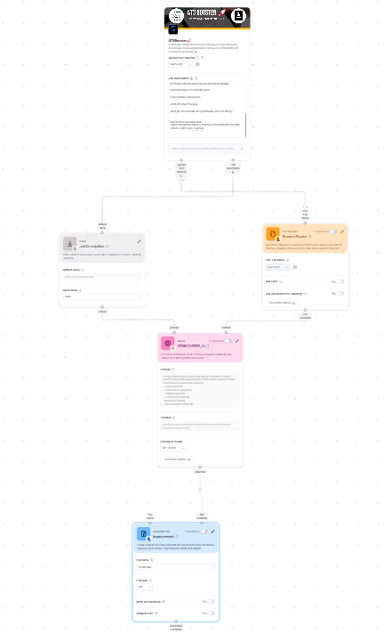
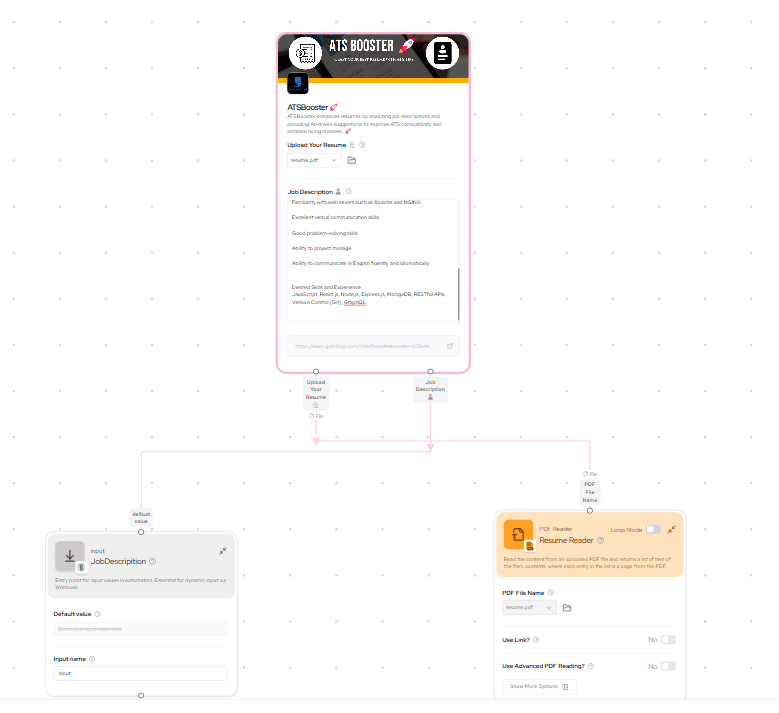
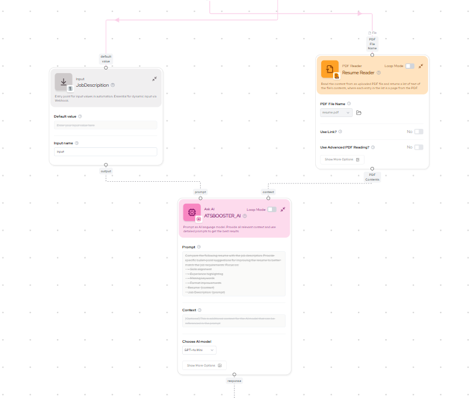
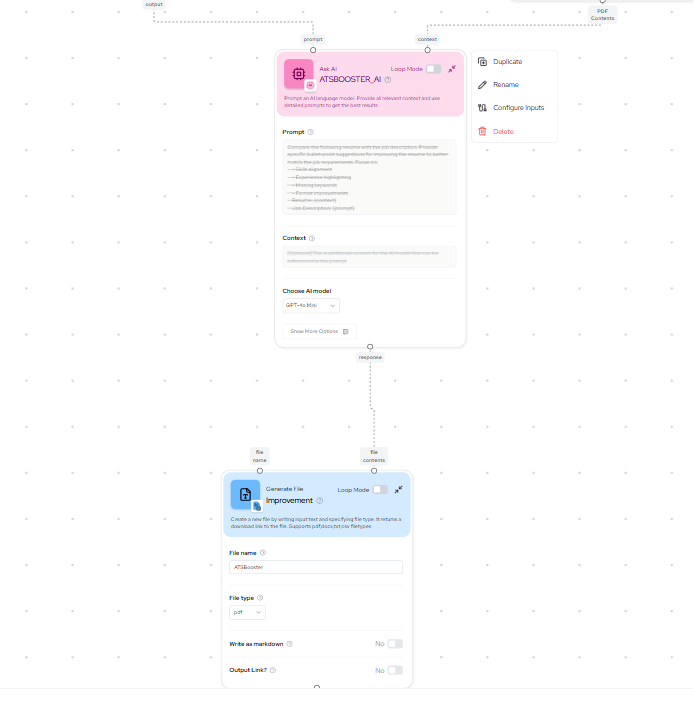

# 🛠 Gumloop AI Resume Optimizer

### 🚀 Overview  
This project uses **Gumloop** and **Gemini AI API** to analyze a resume against a job description and provide suggestions to improve **ATS (Applicant Tracking System) compatibility**. Live Link -> [click me](https://www.gumloop.com/interface/Atsbooster-jVSbrWUfcR8F9eTWtZmaRL)

https://github.com/user-attachments/assets/2177b40b-bdf1-41df-b6d5-201a92c8c1bf

## 🔗 Features  
- 📄 **Upload Resume** (PDF)  
- 📝 **Paste Job Description**  
- 🤖 **AI Analysis**  
- 🔍 **Keyword Matching & Optimization**  
- 📊 **ATS Score & Improvement Suggestions**  
- 📥 **Download Optimized Resume Suggestions**  

---

## 📌 How It Works  

1️⃣ **User Inputs**  
   - Upload resume file or enter text  
   - Paste job description  
   
2️⃣ **AI Processing (Gemini API + Gumloop)**  
   - Extracts keywords from the job description  
   - Compares with resume content  
   - Suggests improvements (skills, formatting, keywords, etc.)  

3️⃣ **Output Suggestions**  
   - Displays missing keywords  
   - Recommends phrase improvements  
   - Highlights key changes to boost ATS score  

---

### Live Images

## Whole Flow

## UserFlow

## InternelFlow

## Outputfile Flow

## Gumllop Workflow 
[gumloopflow](https://www.gumloop.com/pipeline?workbook_id=tS2artvda4K3PMExoJtqwj)

## feel free to use Happy coding.👨🏻‍💻☕🧋
